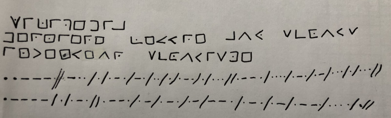

# Bravo! Tu arrives bientôt à la fin! Cherche la suite sur cette page!

La meute de l'Etoile Orion est une unité branche cadette du mouvement EEUDF. Elle a ses locaux au 54 avenue de la grande armée. Elle est aujourd'hui constituée de 30 louveteaux et 7 chefs.

## Histoire

Cette meute a aujourd'hui plus de 100 ans. Ces dernières années elle a vécue de nombreux camps d'été, un peu partout en France.

## Historique des camps

2019: Inspécamp

2018: Scoutatis

2017: Chimicangas

2016: HogwartCamp

2011: Restwood

2010: Canouan

2009: Afarensis

2008: DavanciCamp

## Alimentation des louveteaux

Le louveteau commence la journée avec un car de cacal (cacao au lait) et du pain tartiné avec amour par ses camarades. Pour le déjeuner une règle d'or: faites attention le jour des flambis!
Quelques éléments de langage:
Les biscuits pour chien ne sont pas de vrai biscuits pour chien. Simplement un genre de petit beurre qui s'achète au kilo et qui se mange exclusivement avec de la compote.
La sangria est sans alcool, bien que sa recette soit tenue secrète.

## Jeu de piste

### Bravo!!! Vous y êtes presque! 

ENVOYEZ CE QUE VOUS AVEZ TROUVÉ EN MESSAGE PRIVÉ À UN CHEF!